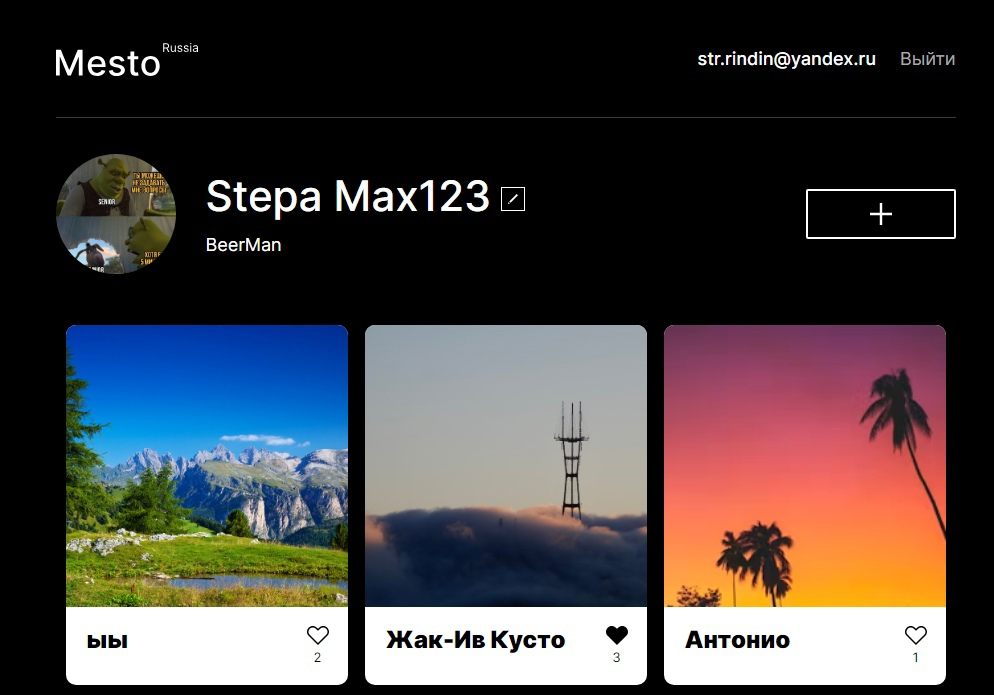

# Проект: Mesto

<h2>1. Описание проекта</h2>
Данная проектная работа - итоговая в рамках образовательной программы Яндекс Практикума. Проект представляет собой адаптивное приложение (SPA), написанное на "React" (часть frontend) и "Node" (часть backend), с возможностью регистрации личного кабинета пользователя, редактированием данных и добавлением фотокарточек в общую галерею.

Изначально приложение было написано на нативных технологиях: JavaScript, CSS3 и HTML5. Затем проект был перенесен на "React" с добавлением функционала регистрации и авторизации пользователей, отдельно написана логика серверной части с фреймворком "Express" и в завершение обе части объединены и сохранены на виртуальной машине, размещенной на Яндекс Облаке.

<b>Адрес репозитория:</b> https://github.com/opigon1/mesto-react-authorization?tab=readme-ov-file

<b>Ссылки на проект:</b>
 
IP 51.250.37.229
 
Frontend https://project.mesto.nomoredomainsmonster.ru (Срок действия истёк)
 
Backend https://project.mesto.nomoredomainsmonster.ru (Срок действия истёк)

<b>Ссылки на макет:</b>
 
https://www.figma.com/file/2cn9N9jSkmxD84oJik7xL7/JavaScript.-Sprint-4?node-id=0%3A1
https://www.figma.com/file/bjyvbKKJN2naO0ucURl2Z0/JavaScript.-Sprint-5?node-id=0%3A1
https://www.figma.com/file/kRVLKwYG3d1HGLvh7JFWRT/JavaScript.-Sprint-6?node-id=0%3A1
https://www.figma.com/file/PSdQFRHoxXJFs2FH8IXViF/JavaScript-9-sprint?node-id=0%3A1
https://www.figma.com/file/5H3gsn5lIGPwzBPby9jAOo/Sprint-14-RU?node-id=0%3A1

<b>Ссылка на чек-лист</b>
 
https://code.s3.yandex.net/web-developer/checklists-pdf/new-program/checklist_15.pdf

<i>\* - проект прошел код-ревью</i>

(<a href="#summary">к оглавлению</a>)

<a name="technologies"><h2>2. Стек технологий</h2></a>

(<a href="#summary">к оглавлению</a>)

<a name="installation"><h2>3. Установка и запуск приложения в локальном репозитории, эксплуатация</h2></a>

1. `git clone git@github.com:opigon1/mesto-react-authorization.git` - клонировать репозиторий (HTTPS) на свое устройство
2. `npm i` - установить зависимости (отдельно - в папке `frontend` и `backend`)
3. `npm run dev` - запустить приложение в режиме разработчика в папке `backend` (можно предварительно настроить `порт 3001`)
4. `npm run start` - запустить приложение в режиме разработчика в папке `frontend`

  <b>NB!</b> На данном этапе не настроена отрисовка ошибок при попытке регистрации пользователя с ранее зарегистрированным электронным адресом, неправильном вводе электронного адреса и/или пароля и т.п. Эти ошибки можно проверить самостоятельно в <b>консоли разработчика</b> во вкладке <b>&laquo;Network&raquo;</b> (ответ с сервера будет выделен красным цветом)

<a name="establishing"><h2>4. Процесс создания</h2></a>
Работа выполнена в <b>1 этап</b>:
 

- Реализовано логирование запросов и ошибок
- Объединены frontend и backend части приложения
- Создан облачный сервер и развернут API
- Создан .env-файл
- Создан домен и прикреплен к серверу
- Выпущены и подключены SSL-сертификаты

<a name="tasks-and-problems"><h3>4.1 Основные задачи, проблемы и их решение</h3></a>

1. Кросс-доменные запросы и механизм CORS

  <b>Решение:</b> скачан и подключен пакет CORS

2. Связывание frontend и backend

  <b>Решение:</b> в связи с тем, что backend был написан несколько иначе, чем учебная серверная часть в процессе подготовки frontend, в процессе тестирования возникали многочисленные ошибки (регистрация/авторизация, не приходили данные, выход из личного кабинета одним пользоваталем и вход другим приводили к сохранению данных первого пользователя и их изменению только после перезагрузки страницы). Связывание проходило локально, были внесены изменения как на backend, так и на frontend

<a name="functionality"><h2>5. Функционал</h2></a>

  
Адаптивный интерфейс <b><i>(в т. ч. новых компонентов и элементов)</i></b>

  

  
Регистрация и авторизация пользователей

  

  
Редактирование данных пользователя

  

  
Обновление аватара

  

  
Добавление новой карточки

  

  
Добавление и снятие лайка (включая счетчик лайков)

  

  
Удаление карточки <b><i>с модальным окном подтверждения действия</i></b>

  

  
Модальное окно успешной/неудачной регистрации на сайте

  

  
Модальное окно с увеличенной фотографией карточки

  

  
Открытие и закрытие модальных окон (по кнопке, <b><i>оверлею</i></b> и <b><i>клавише "Escape"</i></b>)

  

  
<b><i>Спиннеры загрузки</i></b>

  

  
<b><i>Валидация форм</i></b>

  

  
<b><i><b><i>Окно предварительной загрузки страницы</i></b></i></b>

  

                                                                                               

<b><i>Страница 404</i></b>

  

 
<b><i>* - жирным курсивом выделен дополнительный функционал, не входящий в обязательный перечень требований для получения зачета по проектной работе</i></b>

(<a href="#summary">к оглавлению</a>)

<a name="enhancement"><h2>6. Планы по улучшению</h2></a>

- Оптимизация лишних ререндеров
- Вывод в модальном окне после неудачной попытки регистрации/авторизации текста ошибок ("Пользователь с таким электронным адресом уже зарегистрирован", "Неправильный электронный адрес/пароль" и проч.)
- Исправление зависания анимации при открытии/закрытии бургерного меню на iPhone
- Оптимизация приложения для людей с ограниченными возможностями (напр., <b>label</b> для инпутов форм)
- Добавление автоматического обновления галереи карточек
- Добавление функции сабмита форм нажатием на клавишу "Enter" (в настоящий момент работает только в случае клика пользоватем по полю формы)